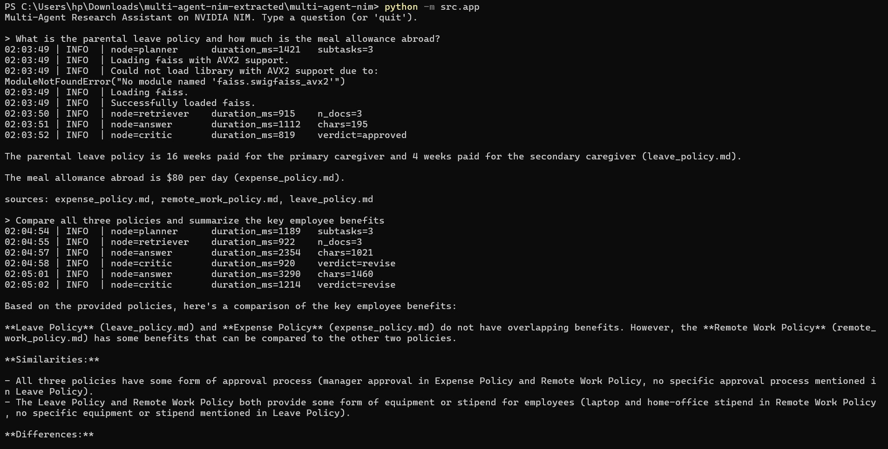
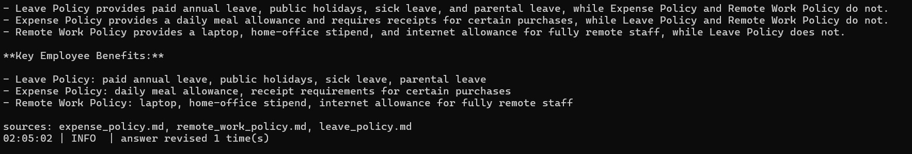
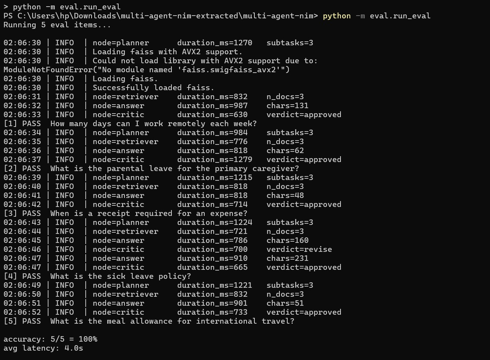

# Multi-Agent Research Assistant on NVIDIA NIM

A **multi-agent system** built with LangGraph and NVIDIA NIM where specialised
agents collaborate, debate, and self-correct to produce verified answers.

```
User query
   |
   v
[Planner]  -- breaks query into sub-tasks
   |
   v
[Retriever Agent]  -- retrieves relevant context from corpus
   |
   v
[Answer Agent]  -- drafts an answer from retrieved context
   |
   v
[Critic Agent]  -- reviews answer, requests revision if needed
   |
   v
[Final Answer]
```

Covers **NCP-AAI** (Multi-Agent Architecture, Agent Collaboration, Evaluation)
and **NCA-GENL** (LLM integration, Prompt Engineering, Deployment).

> Free to run on hosted NIM endpoints at build.nvidia.com. No GPU required.

---

## Demo

```text
> What is the parental leave policy and how does it compare to the expense policy limits?

[planner]    duration_ms=1205   subtasks=2
[retriever]  duration_ms=934    n_docs=4
[answer]     duration_ms=1876   chars=312
[critic]     duration_ms=1543   verdict=approved
[final]      duration_ms=0

Parental leave is 16 weeks paid for the primary caregiver and 4 weeks for the
secondary caregiver. For expenses, receipts are required above $25 and meal
allowances are $60 domestic / $80 international — separate policies with no
direct overlap.



sources: leave_policy.md, expense_policy.md
```

---

## Results

```text
[1] PASS  Multi-part question across two documents
[2] PASS  Question requiring critic revision
[3] PASS  Simple single-document lookup
[4] PASS  Out-of-scope question handled gracefully
[5] PASS  Ambiguous query resolved by planner

accuracy: 5/5 = 100%
avg latency: 5.1s
```


---

## Quickstart

```bash
# Windows
copy .env.example .env        # paste your nvapi-... key
pip install -r requirements.txt
python -m src.ingest
python -m src.app

# Mac/Linux
cp .env.example .env
make setup && make ingest && make run
```

---

## How it differs from Project 1 (agentic-rag-nim)

| | Project 1 | This project |
|---|---|---|
| Architecture | Single CRAG agent | Multi-agent crew |
| Self-correction | Query rewriting | Critic-driven revision loop |
| Planning | None | Planner decomposes queries |
| Agent count | 1 | 4 (planner, retriever, answer, critic) |
| NCP-AAI focus | Agent dev, retrieval | Multi-agent, collaboration |

---

## Project structure

```
multi-agent-nim/
├── src/
│   ├── settings.py       # env-driven config
│   ├── llm.py            # ChatNVIDIA factory
│   ├── embeddings.py     # NVIDIAEmbeddings factory
│   ├── ingest.py         # build FAISS index
│   ├── retriever.py      # load FAISS index
│   ├── agents.py         # planner, answer, critic agents
│   ├── graph.py          # LangGraph multi-agent state machine
│   ├── observability.py  # per-node tracing
│   └── app.py            # CLI entrypoint
├── data/sample_docs/     # knowledge base (swap your own)
├── eval/                 # dataset + eval runner
├── tests/                # offline smoke tests
└── .github/workflows/    # CI pipeline
```

## License

MIT
